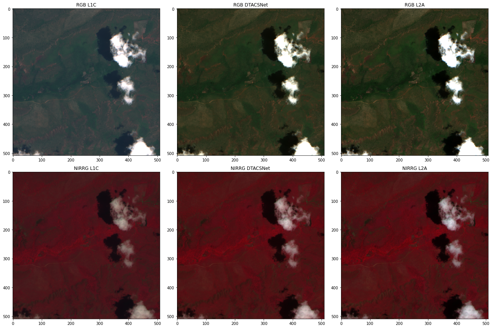

[](https://doi.org/10.1109/JSTARS.2024.3480520) [](https://github.com/spaceml-org/DTACSNet/releases) [](https://pypi.org/project/dtacs/) [](https://pypi.org/project/dtacs/) [](https://github.com/spaceml-org/DTACSNet/blob/main/LICENSE) [](https://spaceml-org.github.io/DTACSNet/)

# [DTACSNet: Onboard Cloud Detection and Atmospheric Correction With Efficient Deep Learning Models](https://ieeexplore.ieee.org/document/10716772)

*Cesar Aybar*<sup>§</sup>, *Gonzalo Mateo-García*<sup>§</sup>, *Giacomo Acciarini*<sup>§</sup>, *Vit Ruzicka*, *Gabriele Meoni*, *Nicolas Longepe*, *Luis Gómez-Chova* <sub><sup>*§ development contribution*</sup></sub>

[10.1109/JSTARS.2024.3480520](https://ieeexplore.ieee.org/document/10716772)

This repo contains an open implementation to run inference with DTACSNet models for atmospheric correction. **This repo and trained models are released under a** [Creative Commons non-commercial licence](https://creativecommons.org/licenses/by-nc/4.0/legalcode.txt) 


Install ⚙️:
```bash
pip install dtacs
```

Run:

```python
from dtacs.model_wrapper import ACModel
model_atmospheric_correction = ACModel(model_name="CNN_corrector_phisat2")
model_atmospheric_correction.load_weights()

ac_output = model_atmospheric_correction.predict(l1c_toa_s2)
```


The figure above shows a sample of Sentinel-2 level 1C, DTACSNet model output and Sentinel-2 level 2A in the RGB (first row) and in the SWIR, NIR, Red (last row) composites.

See the [inference tutorial](https://spaceml-org.github.io/DTACSNet/tutorials/inference_Sentinel-2.html) for a complete example.


## Citation

If you find this work useful for your research, please consider citing [our work](https://ieeexplore.ieee.org/document/10716772):

```bibtex
@article{aybar_onboard_2024,
	title = {Onboard {Cloud} {Detection} and {Atmospheric} {Correction} {With} {Efficient} {Deep} {Learning} {Models}},
	volume = {17},
	issn = {2151-1535},
	url = {https://ieeexplore.ieee.org/abstract/document/10716772},
	doi = {10.1109/JSTARS.2024.3480520},
	urldate = {2024-11-12},
	journal = {IEEE Journal of Selected Topics in Applied Earth Observations and Remote Sensing},
	author = {Aybar, Cesar and Mateo-García, Gonzalo and Acciarini, Giacomo and Růžička, Vít and Meoni, Gabriele and Longépé, Nicolas and Gómez-Chova, Luis},
	year = {2024},
	note = {Conference Name: IEEE Journal of Selected Topics in Applied Earth Observations and Remote Sensing},
	pages = {19518--19529}
}
```

## Acknowledgments

DTACSNet has been developed by Trillium Technologies. It has been funded by ESA Cognitive Cloud Computing in Space initiative project number D-TACS I-2022-00380.

## More Cloud Detection Viz

 Thick cloud
 Thin cloud 
 Cloud shadow


## More Atmospheric Correction Viz


