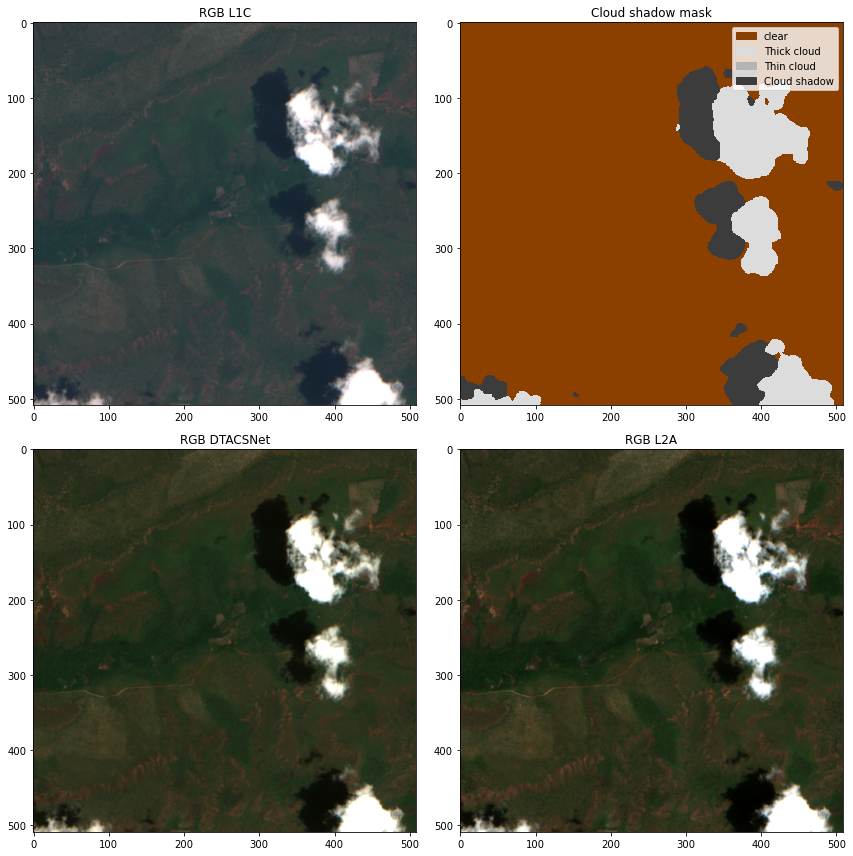

# DTACSNet: onboard cloud detection and atmospheric correction with end-to-end deep learning emulators

This repo contains an open implementation of DTACS models for cloud detection and atmospheric correction. The trained models
provided here are customized to the band configuration that will be available in Phi-Sat-II.

See the [inference tutorial](./tutorials/inference.ipynb) for an example of running the model.

